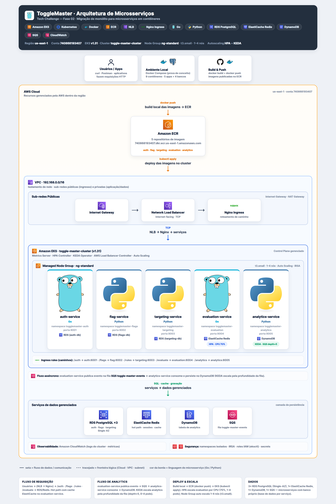

<div align="center">


## 👥 Participantes

| Nome | RM | E-mail |
|---|---|---|
| Marcílio Alves Galindo | 374871 | marcilio@workmail.com |


---

# ToggleMaster

**Plataforma de Feature Flags | Microserviços no Amazon EKS**

Tech Challenge FIAP — Fase 02 | Arquitetura de Microsserviços Distribuídos

[](https://kubernetes.io)
[](https://aws.amazon.com/eks/)
[](https://www.docker.com)
[](https://go.dev)
[](https://www.python.org)
[](https://helm.sh)
[](https://keda.sh)
[](https://github.com)

</div>

---

## 📋 Sobre o Projeto

O MVP monolítico do **ToggleMaster** evoluiu para um ecossistema de **5 microserviços distribuídos**, conteinerizados, provisionados na AWS e implantados em um cluster **Amazon EKS**, com escalabilidade automática via **HPA** e **KEDA**.

> Desafio: conteinerizar, provisionar a infraestrutura de nuvem e implantar os microsserviços em um ambiente de orquestração robusto, escalável e resiliente.

---

## 🏗️ Arquitetura



> Diagrama interativo.

---

## 🧬 Arquitetura dos Microserviços

| Serviço | Linguagem | Porta | Banco de Dados | Responsabilidade |
|---|---|---|---|---|
| `auth-service` | Go | 8001 | PostgreSQL (RDS) | Chaves de API e autenticação |
| `flag-service` | Python | 8002 | PostgreSQL (RDS) | CRUD de definições de feature flags |
| `targeting-service` | Python | 8003 | PostgreSQL (RDS) | Regras complexas de segmentação |
| `evaluation-service` | Go | 8004 | Redis (ElastiCache) | Hot path — decisão final (true/false) |
| `analytics-service` | Python | 8005 | DynamoDB + SQS | Consome eventos e salva análises |

### Fluxo de uma requisição

1. Usuário acessa o **Nginx Ingress** via **Network Load Balancer (NLB)**.
2. O ingress roteia para o serviço correto (`/auth`, `/flags`, `/rules`, `/evaluate`, `/analytics`).
3. `evaluation-service` (hot path) consulta a flag e a regra de segmentação, usa **Redis como cache** e retorna a decisão em milissegundos.
4. Eventos de avaliação são publicados no **SQS** e consumidos pelo `analytics-service`, que grava no **DynamoDB**.

---


## 🔗 Repositórios

- **Código-fonte dos microserviços (Fork do FIAP-TCs):** [https://github.com/FIAP-TCs](https://github.com/FIAP-TCs)

---

## 🎬 Vídeo de Demonstração

- **Link do vídeo (YouTube ou outro):** [https://drive.google.com/file/d/1ubTlU8-fDnGvM2LV7BG524DaMdUQ0f-h/view](https://drive.google.com/file/d/1ubTlU8-fDnGvM2LV7BG524DaMdUQ0f-h/view)

---

## ✅ Resumo da Entrega

> ⚠️ **Aviso:** os arquivos `k8s/*-secret*.yaml` deste repositório contêm **valores placeholder** (`CHANGE_ME`, endereços fictícios) — por segurança, as credenciais reais (senhas RDS, endpoints Redis/SQS, chaves de API) **não são versionadas**.

### 1. Conteinerização (Docker)

- [x] **5 Dockerfiles multi-stage** criados (um por microserviço):
  `auth-service` (Go), `flag-service` (Python), `targeting-service` (Python), `evaluation-service` (Go), `analytics-service` (Python).
- [x] **docker-compose.yml** na raiz com **9 containers**:
  5 aplicações (auth, flag, targeting, evaluation, analytics) + 4 bancos locais (2× PostgreSQL, 1× Redis, 1× DynamoDB Local).
- [x] Ambiente local validado end-to-end (health checks OK, fluxo completo OK).

### 2. Infraestrutura na AWS (Opção B — Conta Pessoal)

- [x] **Cluster EKS:** `toggle-master-cluster` (us-east-1), criado via **eksctl** (método recomendado na Opção B, com roles de IAM geradas automaticamente).
- [x] **Nodegroup:** `ng-standard`, autoscaling de nós **min=1 / desejado=2 / max=4** (instâncias `t3.small`).
- [x] **5 repositórios no ECR**, um por microserviço, com imagens publicadas.
- [x] **3 instâncias RDS PostgreSQL independentes:**

| Instância | Banco |
|---|---|
| `togglemaster-auth-db` | `auth_db` |
| `togglemaster-flags-db` | `flags_db` |
| `togglemaster-targeting-db` | `targeting_db` |

- [x] **1 cluster ElastiCache Redis:** `togglemaster-redis`.
- [x] **1 tabela DynamoDB:** `ToggleMasterAnalytics` (pay-per-request).
- [x] **1 fila SQS Standard:** `toggle-master-events`.
- [x] **Security groups dedicados** (portas 5432 e 6379 liberadas apenas para o security group do cluster) e **subnet groups**.

### 3. Configuração do Cluster (Kubernetes)

- [x] **Metrics Server** instalado (necessário para o HPA).
- [x] **Nginx Ingress Controller** instalado via **Helm**.
- [x] **AWS Load Balancer Controller com IRSA** (*IAM Roles for Service Accounts*) — Opção B recomendada, sem dar permissão total ao nó.
- [x] **OIDC provider e service accounts IRSA** criados para:
  - `evaluation-sa` (SQS)
  - `analytics-sa` (SQS + DynamoDB)
  - `keda-operator` (SQS)
- [x] **KEDA** instalado (namespace `keda`) para autoscaling baseado em eventos.

### 4. Orquestração e Implantação (Manifestos)

- [x] **5 namespaces lógicos:** `togglemaster-auth`, `togglemaster-flags`, `togglemaster-targeting`, `togglemaster-evaluation`, `togglemaster-analytics`.
- [x] Para cada serviço: **Deployment + Service (ClusterIP) + Secret (base64) + ConfigMap** (URLs internas).
- [x] **Requests e Limits** de CPU/memória em todos os deployments.
- [x] **Readiness e LivenessProbe** em todos os deployments.
- [x] **Ingress Nginx** com regras de roteamento:

| Rota | Serviço | Porta |
|---|---|---|
| `/auth` | auth-service | 8001 |
| `/flags` | flag-service | 8002 |
| `/rules` | targeting-service | 8003 |
| `/evaluate` | evaluation-service | 8004 |
| `/analytics` | analytics-service | 8005 |

- [x] **Jobs de migração** aplicaram os schemas SQL nos 3 RDS.

### 5. Escalabilidade

- [x] **HPA (HorizontalPodAutoscaler)** para o `evaluation-service` baseado em CPU (target **70%**, min=1, max=4). **Validado:** adicionou réplicas sob carga e voltou ao mínimo após a carga cessar.
- [x] **KEDA (ScaledObject)** para o `analytics-service` monitorando a fila SQS (*queueLength*, minReplicaCount=**0**, maxReplicaCount=**4**). **Validado:** escalou de 0 pod para N réplicas com 100 mensagens na fila e voltou a 0 ao esvaziar.

#### 🧠 Justificativa da escolha — KEDA por fila (analytics-service)

O `analytics-service` é **orientado a eventos**: seu trabalho só existe quando há mensagens na fila SQS. Escalar por fila é direto e preciso — e, com `minReplicaCount=0`, o custo é **zero** quando não há eventos, o que não é possível com HPA por CPU.

### 6. Diferença de Propósito dos 3 Data Stores

| Data Store | Tipo | Uso |
|---|---|---|
| **RDS (PostgreSQL)** | Relacional | Banco com **ACID** e integridade referencial, usado pelos serviços de dados estruturados (auth, flag, targeting). |
| **ElastiCache (Redis)** | In-memory | Cache de **baixíssima latência**, usado pelo `evaluation-service` (hot path) para responder decisões em milissegundos; dados temporários, recriáveis a partir do RDS. |
| **DynamoDB** | NoSQL | Chave-valor escalável, usado pelo `analytics-service` para armazenar eventos de avaliação de alto volume. |

### 7. Desafios Encontrados

- **Bugs no código-fonte recebido:** imports não utilizados no `auth-service` e `evaluation-service` (Go) e incompatibilidade de versão do Werkzeug com o Flask 2.2 nos 3 serviços Python (corrigido fixando `Werkzeug==2.2.3`).
- **Aplicação dos schemas de banco nos RDS** a partir do cluster (Jobs com imagem `postgres`, pois o RDS não aceita conexão externa).
- **Permissões IRSA** para `evaluation`/`analytics` acessarem SQS/DynamoDB e para o operador do KEDA ler a fila.
- **Codificação (encoding)** ao testar endpoints com acentos via PowerShell (usado UTF-8 explícito nos testes).
- **Nome da instância `t3.medium` não é elegível ao Free Tier** → ajuste para `t3.small` no nodegroup.

### 8. Pontuação Extra

- [x] Link do perfil/badge público: [Perfil Google Cloud Skills Boost](https://www.skills.google/public_profiles/e4934908-5914-4f7d-b495-a0d72fd9c16b)

---

## 🚀 Como Reproduzir

### 📦 Ambiente local (Docker Compose)

```bash
cd C:\FIAP\ToggleMaster
docker compose up -d
docker compose ps
```

### ☁️ Cluster na AWS

```bash
aws eks list-clusters --region us-east-1
eksctl get cluster
```

### 📊 Pods, HPA e KEDA

```bash
kubectl get pods -A
kubectl get hpa -A
kubectl get scaledobject -n togglemaster-analytics
```

### 🌐 Testar o Load Balancer

```powershell
Invoke-RestMethod -Uri "http://k8s-ingressn-ingressn-c0490c5234-05cd15a470fd4390.elb.us-east-1.amazonaws.com/auth/health" -UseBasicParsing
Invoke-RestMethod -Uri "http://k8s-ingressn-ingressn-c0490c5234-05cd15a470fd4390.elb.us-east-1.amazonaws.com/evaluate/health" -UseBasicParsing
```

> O fluxo completo (criar chave → flag → regra → avaliar) está demonstrado no **vídeo de demonstração** desta entrega.

---

## 🛠️ Stack Tecnológica

| Categoria | Tecnologias |
|---|---|
| **Orquestração** | Amazon EKS, Kubernetes 1.31, eksctl, Helm |
| **Containers** | Docker, Docker Compose, Amazon ECR |
| **Autoscaling** | HPA (CPU), KEDA (fila SQS) |
| **Ingress** | Nginx Ingress Controller, AWS Load Balancer Controller, NLB |
| **Linguagens** | Go, Python |
| **Data Stores** | RDS PostgreSQL, ElastiCache Redis, DynamoDB |
| **Mensageria** | Amazon SQS |
| **Segurança/IAM** | IRSA, Security Groups, Secrets (base64) |

---

<div align="center">

**Tech Challenge FIAP — Fase 02** | ToggleMaster | DevOps & Arquitetura Cloud

</div>
